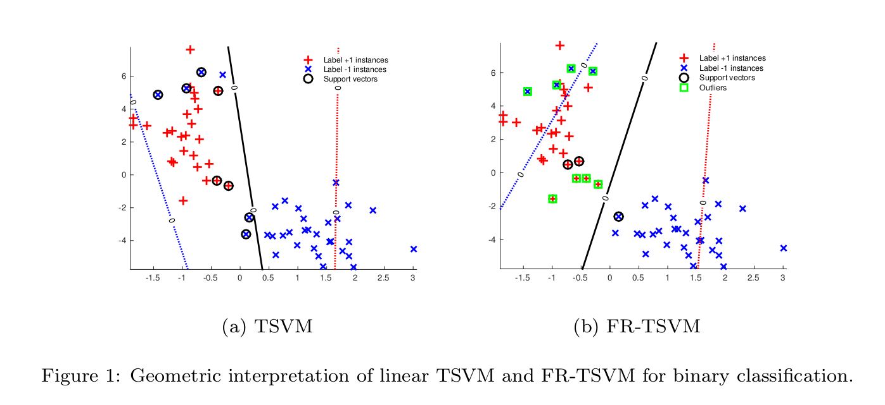

# FRTSVM
This package is a Matlab implementation of ["A Fast and Robust TSVM for Pattern Classification",Bin-Bin Gao, Jian-Jun Wang](https://arxiv.org/abs/1711.05406), which is designed for fast and robust classification. This package is created by [Bin-Bin Gao](http://lamda.nju.edu.cn/gaobb/).

# Usage Instructions:

In matlab, run demo.m.

For any questions and comments, please send your email to csgaobb@gmail.com.
